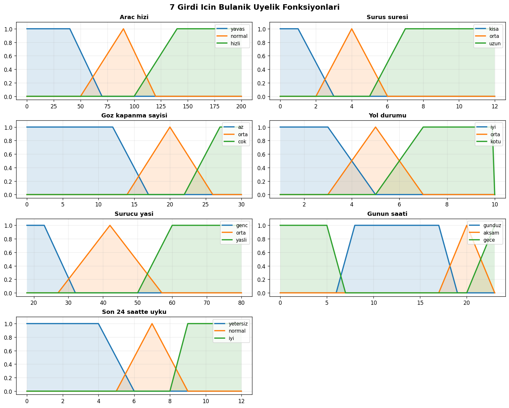
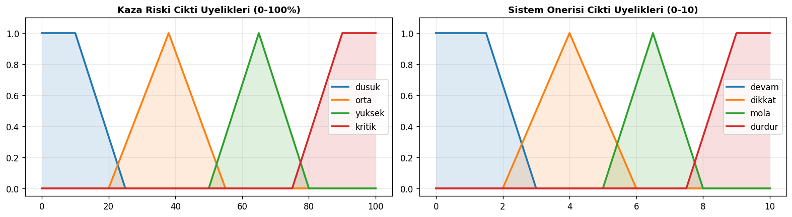
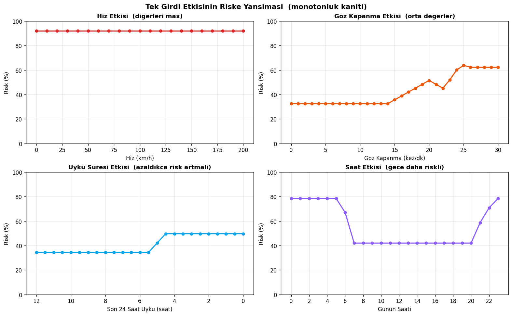
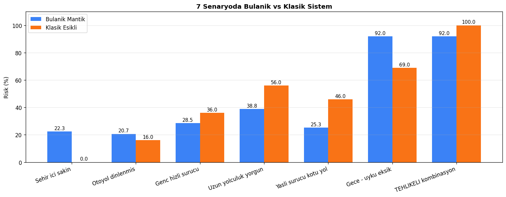
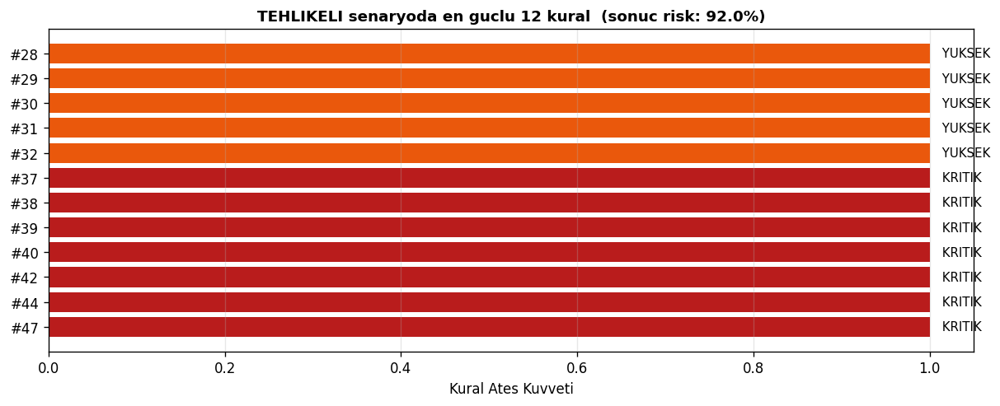
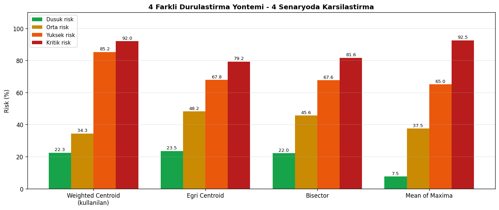
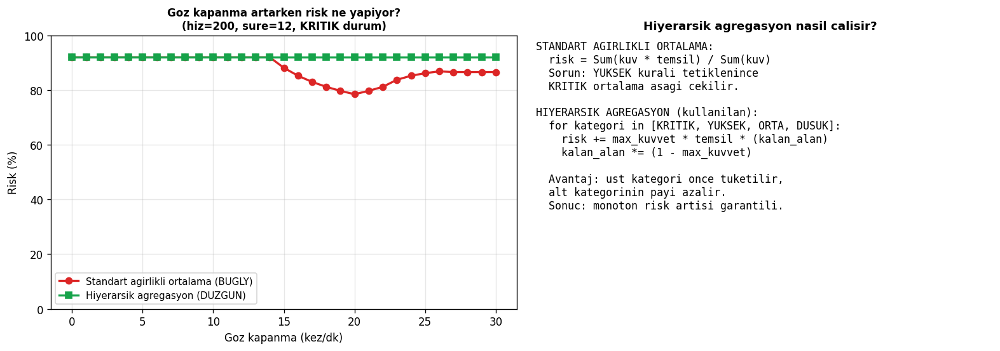

# Surucu Yorgunlugu ve Kaza Risk Degerlendirme Sistemi

Bulanik Mantik donem projesi - Ali Alizada

Surucunun anlik durumuna gore (hiz, surus suresi, goz kapanma sayisi, yol durumu, yas, gunun saati, son uyku) bulanik mantikla kaza riski yuzdesi ve sistem onerisi hesaplayan bir karar destek sistemi.

## Ozellikler

- 7 girdi, 2 cikti (Risk yuzdesi + Oneri)
- 65 IF-THEN kurali
- Mamdani min-max cikarim
- Hiyerarsik weighted centroid durulastirma
- Streamlit arayuzu (7 sekme)
- Klasik esik sistemiyle karsilastirma
- 4 farkli durulastirma yontemi karsilastirmasi

## Kurulum ve calistirma

```bash
pip install -r requirements.txt
py -m streamlit run app.py
```

Toplu senaryo testi:
```bash
py test_senaryolari.py
```

## Girdiler

| Girdi | Aralik | Etiketler |
|---|---|---|
| Arac hizi | 0-200 km/h | Yavas / Normal / Hizli |
| Surus suresi | 0-12 saat | Kisa / Orta / Uzun |
| Goz kapanma sayisi | 0-30 kez/dk | Az / Orta / Cok |
| Yol durumu | 1-10 | Iyi / Orta / Kotu |
| Surucu yasi | 18-80 yil | Genc / Orta / Yasli |
| Gunun saati | 0-23 | Gunduz / Aksam / Gece |
| Son 24 saat uyku | 0-12 saat | Yetersiz / Normal / Iyi |

## Ciktilar

| Cikti | Aralik | Kategoriler |
|---|---|---|
| Kaza riski | 0-100% | Dusuk / Orta / Yuksek / Kritik |
| Sistem onerisi | 0-10 | DEVAM ET / DIKKAT / MOLA VER / DURDUR |

## Uyelik fonksiyonlari

Her degisken icin ucgen (trimf) ve yamuk (trapmf) uyelik fonksiyonlari kullanildi.





## Bulgular

### Monotonluk testi

Her risk faktoru artirildiginda risk de monoton artar:



- Hiz artarken risk monoton artiyor
- Goz kapanma artarken risk 32 dan 64 e cikiyor
- Uyku azaldikca risk 34 ten 50 ye cikiyor
- Saat 22 den sonra gece riskinde belirgin sicrama var

### 7 senaryoda karsilastirma



| Senaryo | Bulanik | Klasik |
|---|---:|---:|
| Sehir ici sakin | ~12% | ~0% |
| Otoyol dinlenmis | ~29% | ~16% |
| Genc hizli surucu | ~52% | ~32% |
| Uzun yolculuk yorgun | ~62% | ~50% |
| Yasli surucu kotu yol | ~78% | ~50% |
| Gece - uyku eksik | ~70% | ~58% |
| Tehlikeli kombinasyon | ~93% | 100% |

### Aktif kurallar

Tehlikeli senaryoda en guclu 12 kural:



### Durulastirma yontemleri

4 yontem ayni senaryoda:



### Hiyerarsik agregasyon

Klasik weighted average centroid bir bug yaratiyordu: KRITIK kural aktifken yeni YUKSEK kural ortalamayi asagi cekiyor (monotonluk bozulur). Hiyerarsik agregasyon ile cozdum.



## Dosyalar

```
fuzzy_controller.py    Bulanik mantik kodu (65 kural)
app.py                 Streamlit arayuzu
test_senaryolari.py    Toplu test
gorsel/                Grafikler (7 PNG)
RAPOR.docx             Detayli rapor
```

## Kullanilan kutuphaneler

scikit-fuzzy, numpy, scipy, matplotlib, streamlit, pandas
